<!-- DO NOT EDIT THIS FILE; IT WAS GENERATED BY ./tools/update-readme -->
<!-- EDIT README.md.tpl INSTEAD -->
# vedv

A tool for developing in a secure, issolated and reproducible environment.

## Table of Contents

Click on the menu right before `README.md` as shown in the image below.

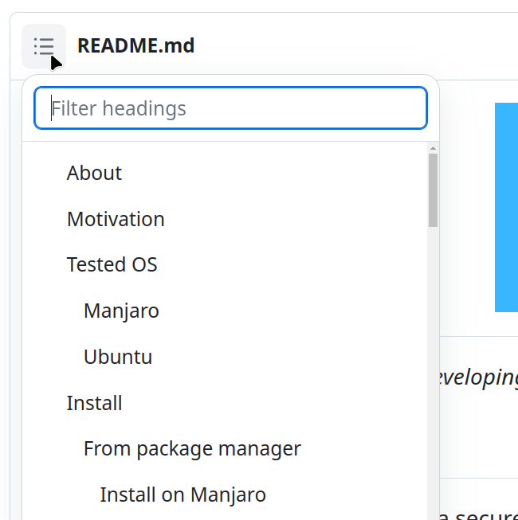

## About

This is a tool for developing applications in a secure, issolated and reproducible environment with virtual machines using a Docker-like workflow.

The software we are developing needs to be tested on a system as close as possible to the one where it is going to be executed. Sometimes it is very difficult to satisfy this requirement with docker and we have to use virtual machines missing the docker workflow. This is why I started the development of vedv. I hope you find it useful. Thank you.

## Tested OS

👉 This tool does not work with nested virtualization, it must be installed and
executed on a real machine. It's tested on the following OS:

### Manjaro

Runtime Dependencies:

```sh
# SYSTEM: Linux yuniel-pc 6.1.44-1-MANJARO #1 SMP PREEMPT_DYNAMIC Wed Aug  9 09:02:26 UTC 2023 x86_64 GNU/Linux
# YAY
bash 5.1.016-2
python 3.11.3-2
python-pip 23.2.1-1
virtualbox 7.0.10-1
openbsd-netcat 1.225_1-1
sshpass 1.10-1
python-pip 23.2.1-1
libxml2 2.11.4-1
# PIP
dockerfile-parse 2.0.0
petname 2.6
```

### Ubuntu

Runtime Dependencies:

```sh
# SYSTEM: Linux user-MS-7D43 6.2.0-26-generic #26~22.04.1-Ubuntu SMP PREEMPT_DYNAMIC Thu Jul 13 16:27:29 UTC 2 x86_64 x86_64 x86_64 GNU/Linux
# APT
bash 5.1-6ubuntu1
curl 7.81.0-1ubuntu1.13
libxml2-utils 2.9.13+dfsg-1ubuntu0.3
netcat-openbsd 1.218-4ubuntu1
python3-pip 22.0.2+dfsg-1ubuntu0.3
python3 3.10.6-1~22.04
sshpass 1.09-1
virtualbox-7.0 7.0.10-158379~Ubuntu~jammy
# PIP
dockerfile-parse 2.0.1
petname 2.6

```

## Install

### From package manager

#### Install on Manjaro

```sh
sudo pacman -Syu --noconfirm --needed yay &&
  yay -Sy --noconfirm --needed vedv-git &&
  sudo pacman -Syu --noconfirm --needed "$(mhwd-kernel -li | grep -Po '\(\Klinux\d+\S*(?=\))')-virtualbox-host-modules" &&
  sudo vboxreload
```

### From git repository

For installation from source code is required to have installed `git` and `make`.
It's recommended to install `bmon` to see the download/upload activity and `vim`
as text editor.

Clone the repository and switch to vedv directory

- from github

```sh
git clone https://github.com/yunielrc/vedv.git && cd vedv
```

#### Install on Manjaro

```sh
make install-deps-manjaro && sudo make install
```

#### Install on Ubuntu

```sh
make install-deps-ubuntu && sudo make install
```

#### Install on any other linux distribution

Install runtime dependencies manually and run the command below:

```sh
sudo make install
```

It's highly recommended for any other linux distro than manjaro and ubuntu to import and run an image from virtualbox gui before running vedv to guarantee that virtualbox is working properly.

Download an alpine image

```sh
wget --header='User-Agent: Mozilla/5.0 (X11; Linux x86_64) AppleWebKit/537.36 (KHTML, like Gecko) Chrome/115.0.0.0 Safari/537.36' 'https://onedrive.live.com/download?resid=DBA0B75F07574EAA%21272&authkey=!AP8U5cI4V7DusSg' -qO alpine-inv.ova
```

Import the image from virtualbox gui:

- Open Virtualbox
- Click on File menu > Import Appliance
- Import the image `alpine-inv.ova`
- Start the `alpine-x86_64` virtual machine

If you have any problem running vedv on your linux distro, it can be a missing dependency, please open a Bug issue.

## Configure

👉 If you don't see the registration **mail** in your inbox, check the **spam** folder.

Register at <https://registry.vedv.dev>

### Create app password

- Go to <https://registry.vedv.dev/settings/user/security>

- Scroll to the end up to the section: **Devices & sessions**

 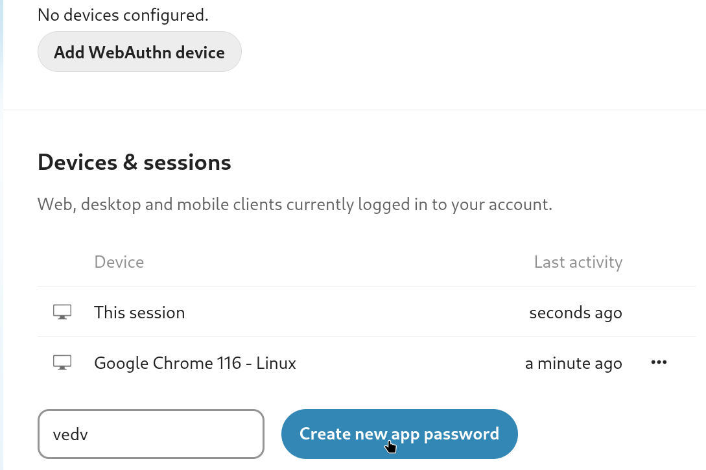

- Write on **App Name**: *vedv*

- Click on **Create new app password**

- Copy the generated password

### Set the credentials

Copy the config to your home directory

```sh
cp /etc/skel/.vedv.env ~
```

Edit the config, set the registry credentials, save and exit

```sh
cd && vim .vedv.env
```

## Usage

Show the help

```sh
vedv --help
```

```sh
# command output:
Usage:
vedv COMMAND

A tool for developing in a secure and reproducible environment

Flags:
  -h, --help    show this help

Management Commands:
  container     manage containers
  image         manage images
  builder       manage builder
  registry      manage registry

Run 'vedv COMMAND --help' for more information on a command.
```

### Start a container

Download an image with custom name, create a container and start it

- To see the download activity, install `bmon`, open it `bmon -b` and select the network interface

```sh
vedv image pull -n alpine admin@alpine/alpine-3.17.3-x86_64
# 10.399s 90Mbps --> download + import + creation time
vedv container create -n alpine alpine
#  1.660s
# starting a container can take up to 1 minute the first time or more
# deppending on your hardware and the image os
vedv container start -w alpine
# 13.395s --> startup + sshd service time to be ready
```

Or download an image and create a container, then start it

```sh
vedv container create -n alpine admin@alpine/alpine-3.17.3-x86_64
# starting a container can take up to 1 minute the first time or more
# deppending on your hardware and the image os
vedv container start alpine
```

Show running container

```sh
vedv container ls
```

### Login to the container

If you see the error: `Connection timed out during banner exchange`,
the container is starting, wait around 10 seconds and try again.
To avoid that you can starts the container with the `--wait` flag

If you run the login command and the container is stopped, it is started automatically

```sh
# login to a container can take up to 1 minute the first time or more
# deppending on your hardware and the image os
vedv container login alpine
```

Play with it :)

Exit the container and remove it

```sh
vedv container rm --force alpine
```

Show the image and copy its name to remove

```sh
vedv image ls
```

Remove the image

```sh
vedv image rm <your-image-name>
```

### Our Application

This is the sample app from <https://www.docker.com/101-tutorial/>.
Thanks to Docker.

We will be working with a simple todo list manager that is running in Node.js.

#### Getting our App

Clone the app repository and switch to its directory

- from github:

```sh
git clone https://github.com/yunielrc/todo-101.git && cd todo-101
```

#### Building the App's Container Image

- Create a file named  `Vedvfile` in the same folder as the file package.json
  with the following contents.

```dockerfile
# Download the image from the registry and import it
FROM admin@alpine/alpine-3.17.3-x86_64
# Set the user, create it if doesn't exist and change the owner
# of WORKDIR recursively
USER root
# Set the working directory and create it if doesn't exist
WORKDIR /app
# Run commands on the current working directory
RUN apk add -U nodejs~18 npm yarn
# Copy package.json to the current working directory
COPY package.json .
# Copy yarn.lock to the current working directory
COPY yarn.lock .
# Install dependencies
RUN yarn install --production
# Copy the service file and set the permissions
COPY --chmod 0755 ./root/etc/init.d/todo-101 /etc/init.d/todo-101
# Add the service to the default runlevel (auto-start on boot)
RUN rc-update add todo-101
# Copy the source code to the current working directory
COPY . .
# Start the service
RUN rc-service todo-101 start
# Expose port 3000
EXPOSE 3000/tcp
```

Vedvfile syntax is highly inspired by Dockerfile, but with some differences

- Save the file and exit

- Build it

```sh
vedv image build -n todo-101-alpine-1.0.0-x86_64
# 55.360s --> [download] + [import] + creation + startup + build + stop time
```

- Create a container from the image

```sh
vedv container create -p 3000:3000/tcp -n todo-101 todo-101-alpine-1.0.0-x86_64
# 1.766s
# When the ports are the same like `3000:3000`  the command below is equivalent
# vedv container create -p 3000/tcp -n todo-101 todo-101-alpine-1.0.0-x86_64
vedv container start -w todo-101
# 13.631s
```

- Open your browser and go to <http://localhost:3000>

  You should see the todo list manager app

 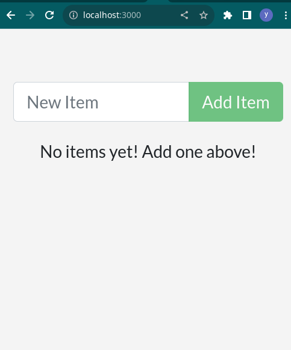

```sh
vedv container rm --force todo-101
# 2.829s
```

#### Updating the Source Code

- In the src/static/js/app.js file, update line 56 to use the new empty text.

```diff
-  <p className="text-center">No items yet! Add one above!</p>
+  <p className="text-center">You have no todo items yet! Add one above!</p>
```

- Let's build our updated version of the image, using the same command we used before.

```sh
vedv image build -n todo-101-alpine-1.0.0-x86_64
# 30.420s --> [download] + [import] + [creation] + startup + build + stop time
```

Each line like the one below is a deleted layer:
`0%...10%...20%...30%...40%...50%...60%...70%...80%...90%...100%`

In this case 4 layers were deleted, starting from `COPY . .` to the end of the file,
and the layer POWEROFF added during the build process.

- Let's start a new container using the updated code.

```sh
vedv container create -p 3000/tcp -n todo-101 todo-101-alpine-1.0.0-x86_64
# 1.811s
vedv container start -w todo-101
# 13.698s
```

- Refresh your browser on <http://localhost:3000> and you should see your updated help text!

- Remove the container

```sh
vedv container rm --force todo-101
# 3.207s
```

#### Push the image to the registry

👉 There is only 200MB of free space for each user at the moment, so use it
   for testing purposes only.
<!--
💰  I am looking for funding to increase the storage space and provisioning
    a best server.
-->

```sh
vedv image push <your_user_id>@alpine/todo-101-alpine-1.0.0-x86_64
# 1m 31.28s 12Mbps
# If you want to push the image with a different name run the command below:
# vedv image push -n todo-101-alpine-1.0.0-x86_64 <your_user_id>@alpine/<your_image_name>-1.0.0-x86_64
```

- On finish open your browser and go to <https://registry.vedv.dev/apps/files/?dir=/00-user-images>

You should see the collection:

```
<your_user_id>@alpine
```

- Click on the collection and you should see the image file an its .sha256sum file:

```
todo-101-alpine-1.0.0-x86_64.ova
todo-101-alpine-1.0.0-x86_64.ova.sha256sum
```

**The uploaded image size is around 130MB, to give chance other users to test vedv,
please delete the image from the registry and push an image link instead. Thanks.**

👍 **Congratulations**, you have **builded** and **uploaded** your first image to the registry.

### Share your image

By default the images are private, only you can see them.

To make your image public, you need to share it with the group `public`.

- Open your browser and go to <https://registry.vedv.dev/apps/files/?dir=/00-user-images>

- Click the **Share** button on the image you want to share

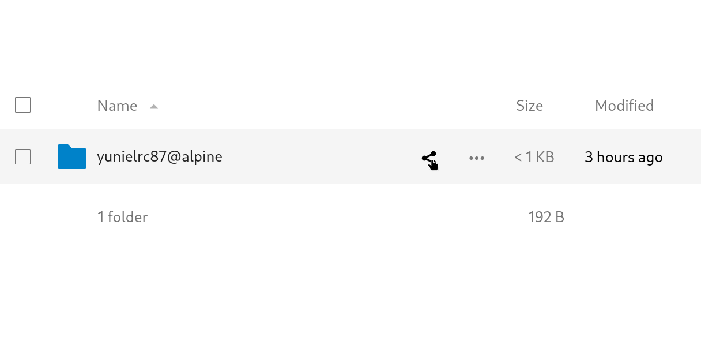

- Or click the **Share folder** menu item

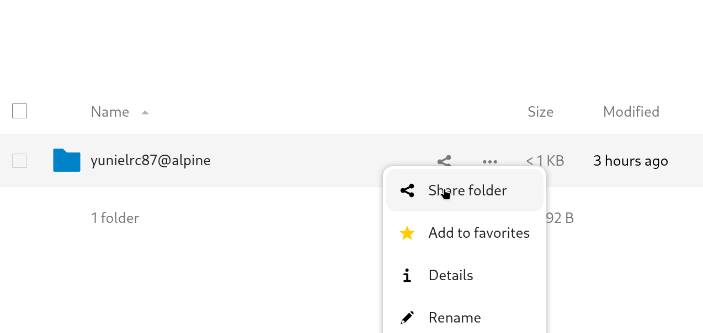

- On the **Sharing** panel search for `public` group and select it

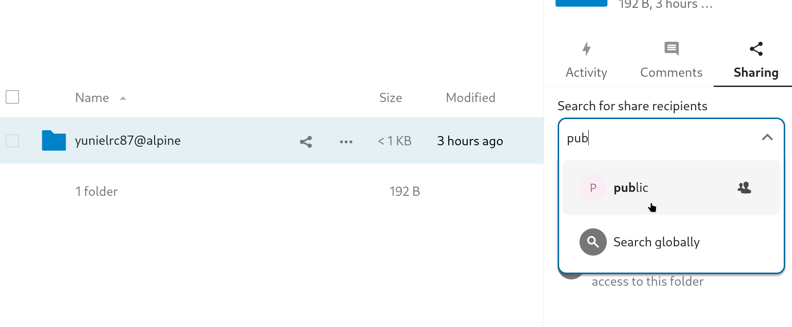

- If the image is shared the collection must have the **Shared** icon

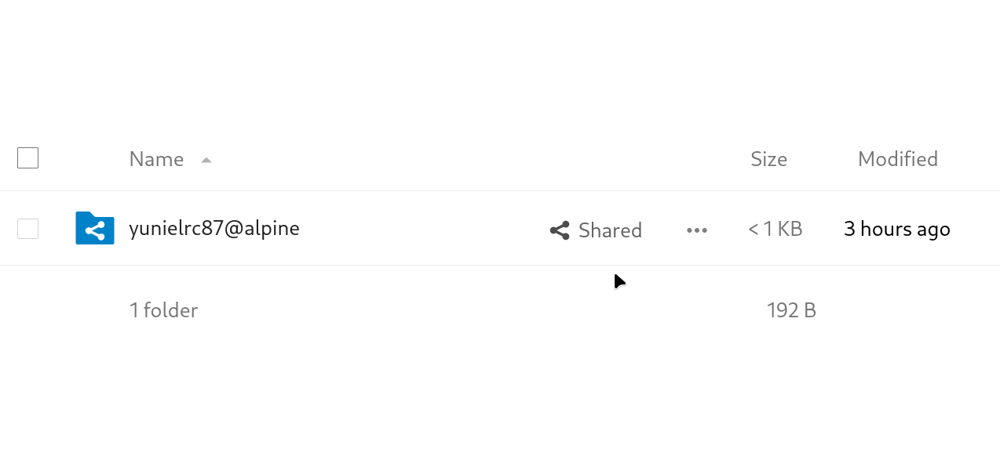

👍 **Congratulations**, your image is **Public** and other users can download and use it

### Push an image link to the registry

**If your registry has images that weights MB, to give chance other users to test
vedv, please delete that images and push image links instead. Thanks.**

Due to the limited storage space at the moment, you should push image links to
the registry.

- Export the image to a file with the .ova extension

```sh
vedv image export todo-101-alpine-1.0.0-x86_64 todo-101-alpine-1.0.0-x86_64.ova
# 8.157s
```

- Upload the image and the .sha256sum to OneDrive or Google Drive or any http server,

⚠️  **OneDrive and Google Drive services are always trying to make it difficult to download
files with no recognized clients.**

#### Share on OneDrive

1. Go to <https://onedrive.live.com>

2. Open the image file menu and Click on **Embed** as shown in the image below

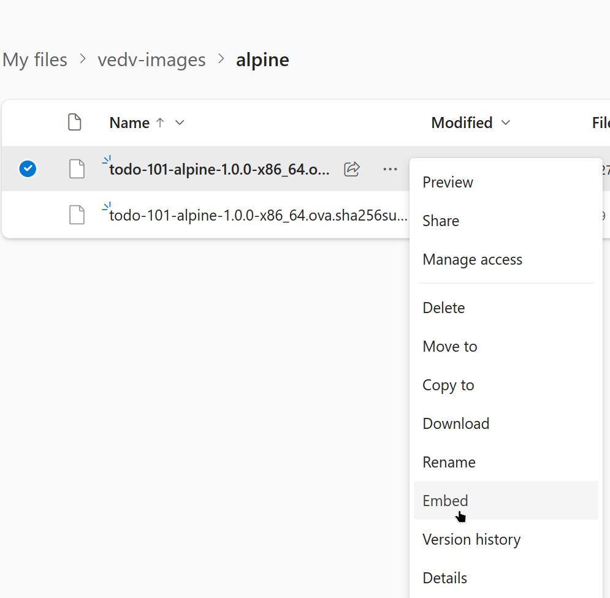

3. Click on **Generate** button

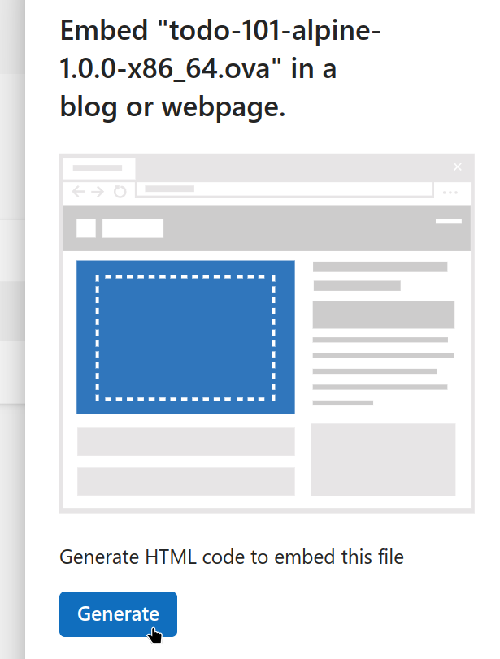

4. Reaload onedrive page and Click on **Shared**

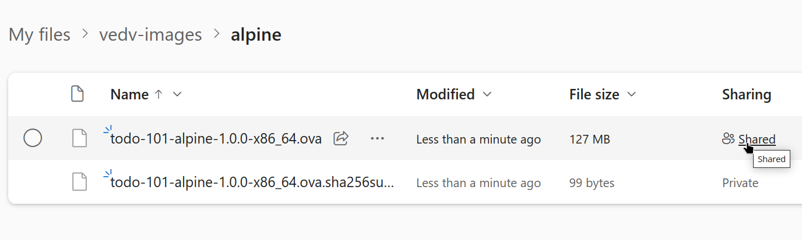

5. Click on **Links Tab** and Copy it

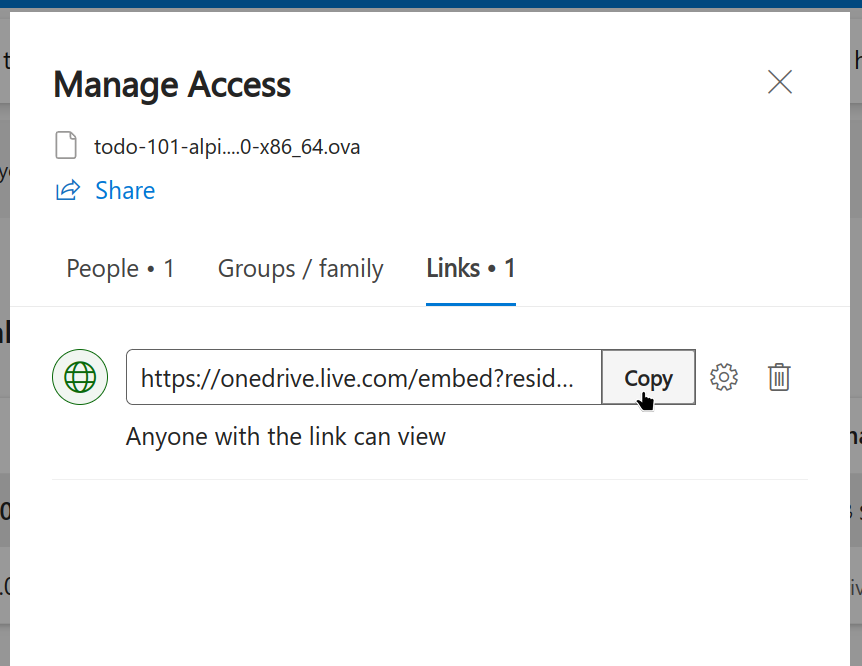

- Open your terminal and save the image link to a variable

Replace `<image_link>` with the link you have copied

```sh
image='onedrive=<image_link>'
```

- Repeat the steps 1-5 for sharing the .sha256sum file

- On the same terminal save the .sha256sum link to a variable

Replace `<sum_link>` with the link you have copied

```sh
sum='onedrive=<sum_link>'
```

##### Push the image link to the registry

- On the same terminal execute the command below

```sh
vedv image push-link --image-address "$image" --checksum-address "$sum" \
 <your_user_id>@alpine/todo-101-alpine-1.0.0-x86_64
 # 2.706s
```

- Remove the image to download it again to test the link

```sh
vedv image rm todo-101-alpine-1.0.0-x86_64
# 0.995s
```

- Pull the image from the link

Use the flag `--no-cache` to download the image again

```sh
vedv image pull --no-cache -n todo-101-alpine-1.0.0-x86_64 \
  <your_user_id>@alpine/todo-101-alpine-1.0.0-x86_64
# 17.334s 90Mbps
```

👍 Congratulations, you have uploaded your image link to the registry and saved space for other users.

#### Share on Google Drive

1. Go to <https://drive.google.com/>

2. Open the image file menu and Click on **Share** as shown in the image below

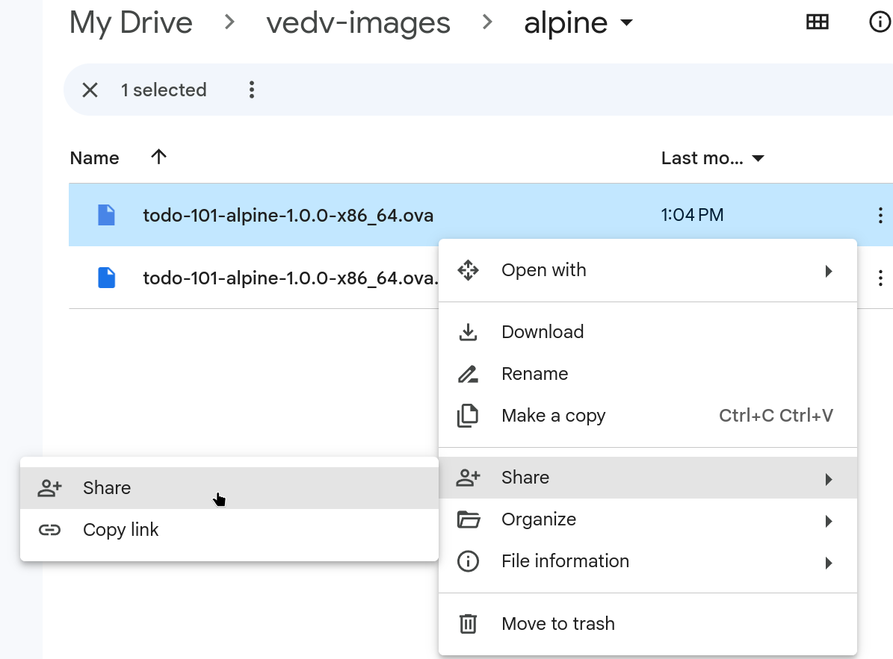

3. Click on **General access** and select **Anyone with the link**

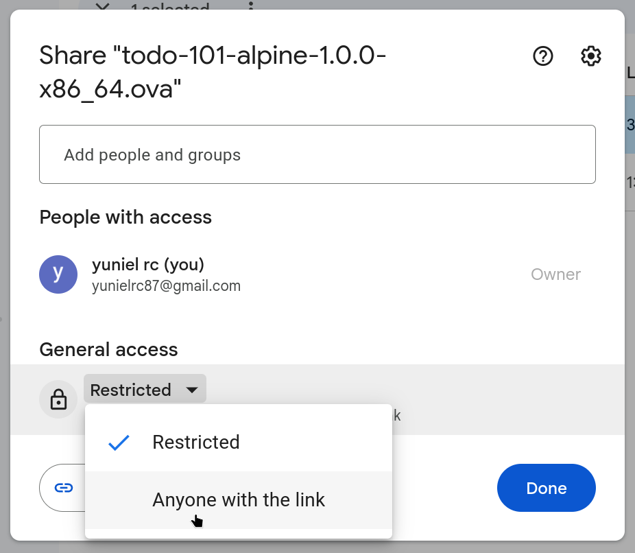

5. Copy the link and click on **Done**

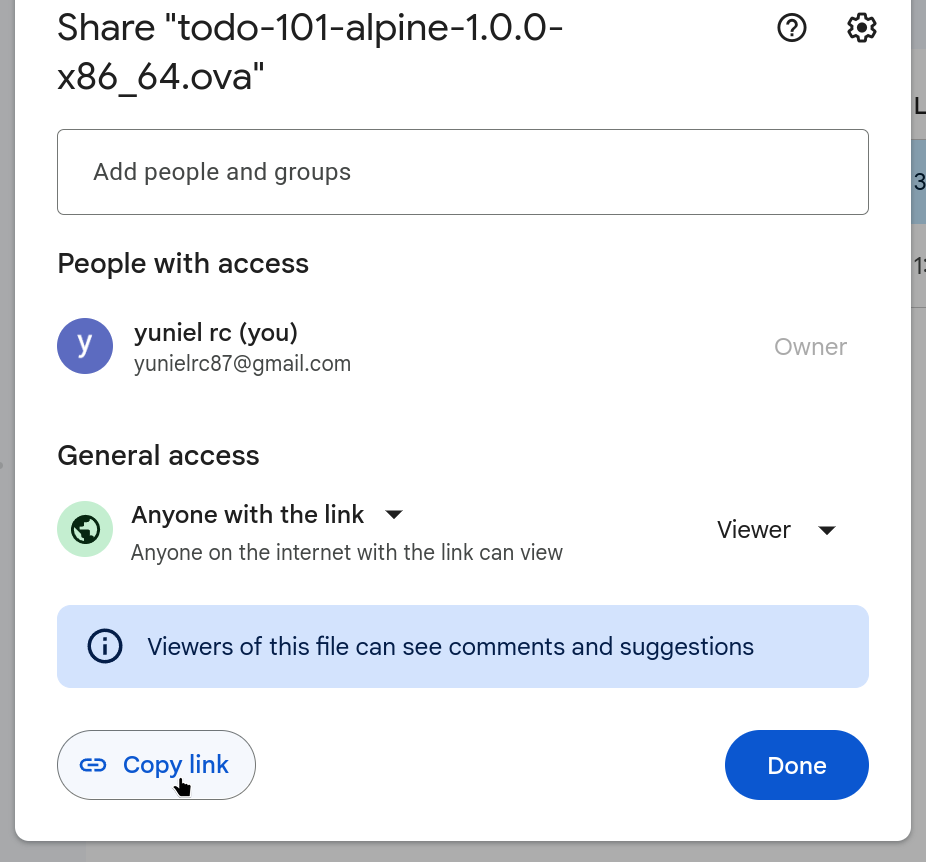

- Open your terminal and save the image link to a variable

Replace `<image_link>` with the link you have copied

```sh
image='gdrive-big=<image_link>'
```

- Repeat the steps 1-5 for sharing the .sha256sum file

- On the same terminal save the .sha256sum link to a variable

Replace `<sum_link>` with the link you have copied

```sh
sum='gdrive-small=<sum_link>'
```

##### Push the image link to the registry

- On the same terminal execute the command below

```sh
vedv image push-link --image-address "$image" --checksum-address "$sum" \
 <your_user_id>@alpine/todo-101-alpine-1.0.0-x86_64
```

If you see the error below:
`
error downloading file from https://drive.google.com/file/d/......
`

Execute the command below at least 5 times:

```sh
wget --no-check-certificate \
 --connect-timeout 10 \
 --header "User-Agent: Mozilla/5.0 (X11; Linux x86_64) AppleWebKit/537.36 (KHTML, like Gecko) Chrome/115.0.0.0 Safari/537.36" \
 -O "alpine-3.18.3-x86_64-fat-inv.ova.sha256sum" "https://docs.google.com/uc?export=download&id=1X5v6DYZeEo3zLLd2ZYIEbRO4hI1IQ9gY"
```

If google drive respond with `ERROR 500` or `ERROR 403`,
and you make a right copy of the url, the error is due google drive it's having problems
or it can be doing some nasty things to make it hard to download.

- Remove the image to download it again to test the link

```sh
vedv image rm todo-101-alpine-1.0.0-x86_64
```

- Pull the image from the link

Use the flag `--no-cache` to download the image again

```sh
vedv image pull --no-cache -n todo-101-alpine-1.0.0-x86_64 \
  <your_user_id>@alpine/todo-101-alpine-1.0.0-x86_64
```

- Remove the image

```sh
vedv image rm --force todo-101-alpine-1.0.0-x86_64
```

👍 Congratulations, you have uploaded your image link to the registry and saved space for other users.

### Vedvfile instructions

```dockerfile

# --------------
# Text surrounded by `` on the comments here is for emphasize.

# Environment variables are always expanded in the Vedvfile keeping its quotes,
# even those surrounded by ''. To avoid a variable expansion on Vedvfile escape
# it, e.g.: \$VAR
# The scope of environment variables is Vedvfile and image os.

# Globbing is disabled in the Vedvfile, it is only enabled on the image os.

# All instructions are evaluated in the Vedvfile, except:
# RUN, to send the command to the image os as it is.
# ENV, to send the variable to the image os as it is, with its quotes.
# (unescaped environment variables are expanded in RUN and ENV instructions too)

# Host os environment variables aren't available in the Vedvfile
# -------------
# Download the image from the registry and import it
FROM admin@alpine/alpine-3.17.3-x86_64
# Declare an environment variable
# image os evals `DEST=dest`
ENV DEST=dest
# Image os evals `GREETINGS='hello world'`
ENV GREETINGS='hello world'
# Set the shell
SHELL /bin/sh
# Copy all files from `src` to `dest`. `COPY src/* dest` doesn't work because
# globbing is disabled in the Vedvfile.
COPY src/ dest
# Copy as root user
COPY --root ./src ./dest
# Copy and change user and group of `dest` to vedv recursively
COPY --chown vedv:vedv src dest
# Copy `src` to `WORKDIR` as vedv user
COPY --user vedv src .
# Variable `DEST` is expanded in the Vedvfile
COPY . $DEST
# Run command as root user
RUN --root id
# Run command as vedv user
RUN --user vedv id
# Variable is expanded in the Vedvfile
# image os evals `echo "hello world"`
RUN echo "$GREETINGS"
# Variable is expanded in the image os, the output is the same as the previous
# command, image os evals `echo "$GREETINGS"`
RUN echo "\$GREETINGS"
# Variable is expanded in the Vedvfile
# image os evals `echo 'hello world'`
RUN echo '$GREETINGS'
# Change the system cpu cores and memory
# Never use this instruction at the end of the Vedvfile, because it poweroff
# the image and don't save the state, so a rebuild will take more time.
# It is a very time consuming instruction, to change cpu cores and memory,
# the image needs to be turned off, the instruction is executed, and the image
# is turned on again by the next instruction.
SYSTEM --cpus 2 --memory 512
```

## Official Images

Transparency and security are very important to us, so all official images
are created from the scratch, here are the steps:

1. The OS iso is downloaded from the official source and verified
2. A vm is created from the iso on Virtualbox and started
3. The vm is configured for vedv. e.g.: For alpine linux 3.17.3-x86_64
   image configuration:
    - 3.1. The specific CaC script `icac/images/alpine-linux.vm.prod.cac` is
         copied and executed in the vm.
    - 3.2. The common linux CaC script `icac/images/common-linux.vm.prod.cac`
         is copied and executed in de the vm.
4. The vm is securely powered off and exported to an `alpine.ova` file
   from Virtualbox
5. The `alpine.ova` file is imported with the command:
  `vedv image import -n alpine-3.17.3-x86_64 ./alpine.ova`
6. The image is uploaded to the registry with the command:
  `vedv image push admin@alpine/alpine-3.17.3-x86_64`
7. The image is tagged as `Official` on registry web interface
8. The image is shared with the group `public` on registry web interface

We encourage you to read the CaC scripts to see what they do
inside the vm.

## Registry

The registry is a Nextcloud instance, you can host your own registry, Nextcloud
is free and open source software.

The scripts for provision and configuration are located at
`icac/nextcloud/vultr.prod/nextcloud-aio`.

If you want to host your own registry on Vultr you must have a vultr account
(I am not associated with vultr), then follow the steps below:

- Copy and edit the .env file, inside the .env look for the section `icac/nextcloud/vultr`

```sh
cp .env.sample .env
vim .env
```

- Provision and Configure the registry

```sh
make registry-prod-setup
```

If you want to host your own registry on any other cloud provider, you can reuse
the CaC script and write your IaC script for provisioning.

## Use Cases

### ydf

ydf is a dotfiles manager+ that uses vedv for developing.

ydf is the kind of tool that make changes to your system, install apps and write config files,
so it needs to be tested in a secure, issolated and reproducible environment, to avoid damaging
your system and to guarantee that the changes made by ydf are always reproducible on a clean
system during testing. Many apps that are installed by ydf are made for a desktop environments,
others apps rely on systemd, and others technologies that doesn't work in docker containers.

ydf is developed initially for Manjaro so the vedv image used is `admin@manjaro/manjaro-gnome-22.1.3-x86_64`

You should open and see the 4 files below available on ydf project to understand how to use vedv
during development:
`Makefile`, `tools/ct-clean-exec`, `Vedvfile`,`.vedvfileignore`

Start with the Makefile at: <https://github.com/yunielrc/ydf/blob/master/Makefile>

Good luck.

## Contributing

Contributions, issues and feature requests are welcome!

### Manjaro dev dependencies

```sh
# SYSTEM: Linux yuniel-pc 6.1.44-1-MANJARO #1 SMP PREEMPT_DYNAMIC Wed Aug  9 09:02:26 UTC 2023 x86_64 GNU/Linux
# YAY
make 4.4.1-2
davfs2 1.7.0-1
python-pre-commit 2.20.0-3
shfmt 3.7.0-1
shellcheck 0.9.0-45
nodejs 20.5.0-1
npm 9.8.1-1
bash-bats 1.9.0-1
bash-bats-assert-git 2.1.0-1
bash-bats-file 0.4.0-2
bash-bats-support-git 0.3.0-1
vultr-cli 2.17.0-1
# NPM
@commitlint/cli@17.7.1
@commitlint/config-conventional@17.7.0
commitizen@4.3.0
cz-conventional-changelog@3.3.0

```

### Ubuntu dev dependencies

```sh
# SYSTEM: Linux user-MS-7D43 6.2.0-26-generic #26~22.04.1-Ubuntu SMP PREEMPT_DYNAMIC Thu Jul 13 16:27:29 UTC 2 x86_64 x86_64 x86_64 GNU/Linux
# APT
davfs2 1.6.1-1
make 4.3-4.1build1
pre-commit 2.17.0-1
# SNAP
node 18.17.1
shellcheck v0.9.0
shfmt 3.5.1
# NPM
@commitlint/cli@17.7.1
@commitlint/config-conventional@17.7.0
bats@1.10.0
commitizen@4.3.0
cz-conventional-changelog@3.3.0
# GITHUB
bats-support
bats-assert
bats-file
vultr-cli

```

### Configure dev environment

#### Copy config samples

Execute the command below to copy config samples to the product root directory

```sh
cp .env.sample .env
cp .vedv.env.sample .vedv.env
```

#### Install dependencies

For Manjaro:

```sh
make OS=manjaro configure
```

For Ubuntu:

```sh
make OS=ubuntu configure
```

#### Setup registry development service

Execute the command below to provision and configure the registry development service
on local machine

```sh
make registry-dev-setup
```

### Workflow

#### Code

Write your code

#### Run Tests

⚠️ **Before testing, Virtualbox can't have any virtual machines or hard disks otherwise,
functional and integration tests that work with virtualbox will fail.**

⚠️ **Some functional and integration tests use OneDrive and Google Drive services, if any
of these services fail, the test will fail too.**

If functional and integration tests that work with virtualbox are failing,
delete all virtual machines and hard disks from Virtualbox and delete the
Virtualbox VMs directory usually located at `~/VirtualBox\ VMs` and run the tests again.

Before testing, the **registry development service must be started**.
Check the status with the command below.

```sh
make registry-dev-status
```

Start it if stopped

```sh
make registry-dev-start
```

Run Unit Testing for one component

```sh
make test-suite u="$(fd registry-service.bats)"
# 4.899s
```

Run Unit Testing for one function

```sh
make test-name n='::push_link\(\)' u="$(fd registry-service.bats)"
# 0.676s
```

Run Integration Testing for one function

```sh
make test-name n='download_file()' u="$(fd registry-nextcloud-api-client.i.bats)"
# 3.105s
```

Run Functional Testing for one function

```sh
make test-name n="vedv registry push[^-]" u="$(fd registry-command.f.bats)"
# 13.85s
```

Run All Unit Tests

```sh
make test-unit
# 1m 4.09s
```

Run All Integration Tests

```sh
make test-integration
```

Run All Functional Tests

```sh
make test-functional
```

Run All tests

On Manjaro

```sh
make OS=manjaro test-all
# 45m 12.79s
```

On Ubuntu

```sh
make OS=ubuntu test-all
```

#### Commit

This project uses [Conventional Commits](https://www.conventionalcommits.org/en/v1.0.0/).

For commiting use the command below

```sh
make commit
```

## Show your support

Give a ⭐️ if this project helped you!
